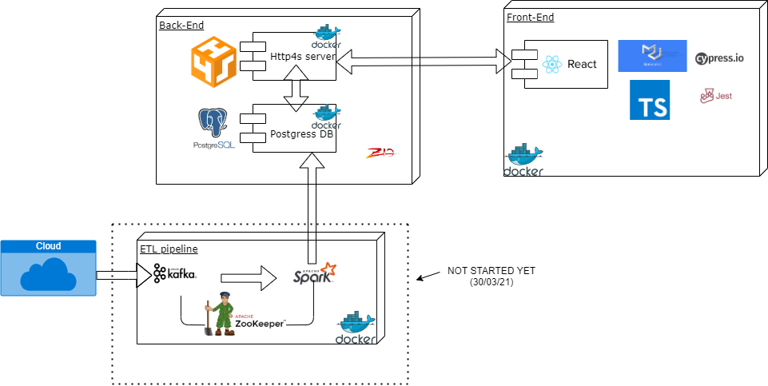

## An example fullstack project using **Scala with ZIO** and a **Typescript react** client
===================================================================

Requirements:
 - java installed
 - docker installed

Running it (all):
**(you need to have docker installed for most of it to work)**
 * Start the server from root directory using `sbt run` (check localhost:8080/hello)
 * `docker-compose up` from root directory to start containers for **front-end** and the **database**

To run the front-end on it's own **(without docker)**
* `yarn start` from client directory ( and check localhost:3000)

